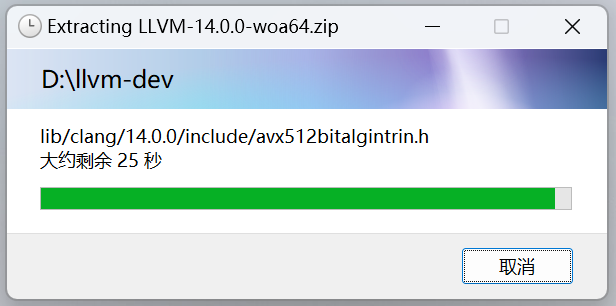
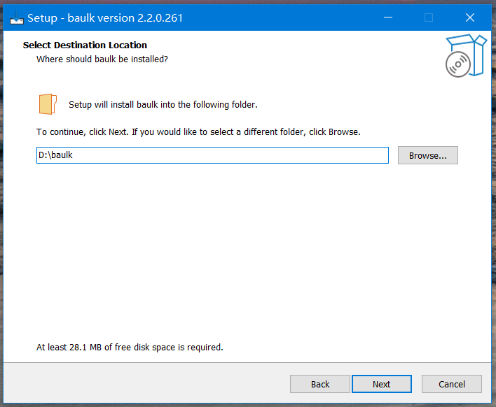
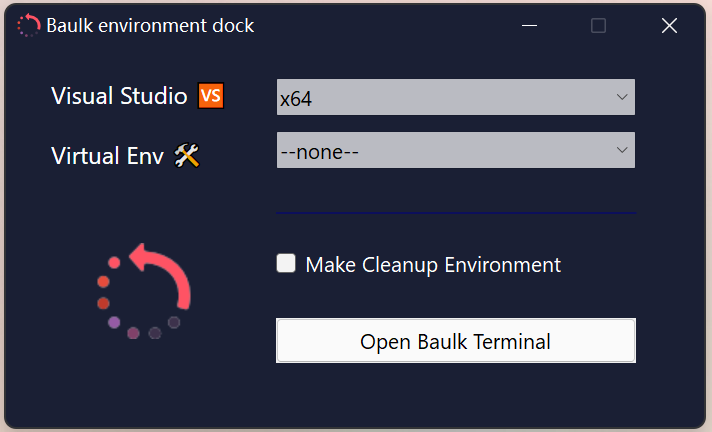

# Baulk - Windows 极简包管理器

[](LICENSE)
[](https://github.com/baulk/baulk/actions)
[](https://github.com/baulk/baulk/releases/latest)
[](https://github.com/baulk/baulk/releases)
[](https://github.com/baulk/baulk/releases/latest)
[](https://996.icu)


Baulk 是一个极简的 Windows 包管理器，免安装，不修改系统环境变量，易于使用，能够和 Windows Terminal 集成，能够添加到右键菜单... 无论是 zip/7z/msi 都能管理。

## Baulk 4.0

We plan to release baulk 4.0 version on April 1, 2022. This version adds a vfs mechanism to avoid mixing program data and installed packages when installing packages. It also adds the following features: 

- Better **VFS** design
- More C++20/23 experience
- Better file extraction experience, add `baulk extract` command.
- Limited compatibility with scoop manifest (Compatibility mode operation, with certain limitations) 
- baulk breakpoint download support
- Integrate a better memory allocator, such as mimalloc
- baulk brand command (such as neofetch)
- `uncrew` Simple, the interface is based on the tar/zip one-click extraction tool of `IProgressDialog`
- Windows 11 context menu support (Not published to the Microsoft Store, the experience needs to be self-signed)

baulk brand:


unscrew:




## 开始使用 

下载 Baulk 最新版本：[https://github.com/baulk/baulk/releases/latest](https://github.com/baulk/baulk/releases/latest), 你可以选择下载对应 Windows 平台的安装程序，Baulk 提供的安装程序无需管理员权限即可运行，你可以将其安装到任意非管理员权限目录，你可以勾选创建桌面快捷方式：




或者你可以下载压缩包然后将其解压到任意目录, 点击 `baulk-terminal.exe` 后即可运行 Windows Terminal。


```powershell
baulk update
# 安装你需要的任意软件包
baulk install baulktar baulk7z neovim curl wget ripgrep
# 现在你可以在 Windows Terminal 中运行 curl 等命令了
curl -V
# 更新源数据
baulk update
# 升级可升级的包
baulk upgrade
# 卸载你不需要的包
baulk uninstall wget
```

**上面就是 Baulk 的基本使用了，非常简单，如果你需要对 Baulk 有个更深入的了解，可以继续阅读下面的内容。**

## 命令行参数

baulk 命令是 Baulk 包管理器的核心，实现各种报的安装，升级，和卸载等功能。baulk 的命令行参数大致分三部分，第一部分是 `option`，用于指定或者设置一些变量；第二部分是 `command` 即 baulk 子命令，包括安装卸载，升级，更新，冻结，解除冻结等命令；第三部分则是跟随子命令后的参数。不同的命令参数根据实际情况选择合适的参数。

```txt
baulk - Minimal Package Manager for Windows
Usage: baulk [option] <command> [<args>]
  -h|--help        Show usage text and quit
  -v|--version     Show version number and quit
  -V|--verbose     Make the operation more talkative
  -Q|--quiet       Make the operation more quiet
  -F|--force       Turn on force mode. such as force update frozen package
  -P|--profile     Set profile path. default: $0\config\baulk.json
  -A|--user-agent  Send User-Agent <name> to server
  -k|--insecure    Allow insecure server connections when using SSL
  -T|--trace       Turn on trace mode. track baulk execution details.
  --https-proxy    Use this proxy. Equivalent to setting the environment variable 'HTTPS_PROXY'
  --force-delete   When uninstalling the package, forcefully delete the related directories


Command:
  version          Show version number and quit
  list             List installed packages based on package names
  search           Search in package descriptions
  info             Show package information
  install          Install specific packages. upgrade if already installed. (alias: i)
  uninstall        Uninstall specific packages. (alias: r)
  update           Update bucket metadata
  upgrade          Upgrade all upgradeable packages
  freeze           Freeze specific package
  unfreeze         UnFreeze specific package
  b3sum            Calculate the BLAKE3 checksum of a file
  sha256sum        Calculate the SHA256 checksum of a file
  cleancache       Cleanup download cache
  bucket           Add, delete or list buckets
  untar            Extract files in a tar archive. support: tar.xz tar.bz2 tar.gz tar.zstd
  unzip            Extract compressed files in a ZIP archive

Alias:
  i  install
  r  uninstall
  u  update and upgrade

See 'baulk help <command>' to read usage a specific subcommand.
```

|命令|描述|备注|
|---|---|---|
|list|查看已安装的包|N/A|
|search|搜索 Bucket 中可用的包|baulk search 命令支持文件名匹配模式，比如 `baulk search *` 将搜索 Bucket 中所有的包|
|info|显示包的相关信息|N/A|
|install|安装特定的包|install 还具备其他特性，当包已安装时会重新构建启动器，当包存在新版本时会将其升级，`--force` 将升级被冻结的包|
|uninstall|卸载特定的包|N/A|
|update|更新 bucket 元数据|类似 Ubuntu apt update 命令|
|upgrade|更新存在新版本的包|`--force` 可升级被冻结的包|
|freeze|冻结特定的包|被冻结的包无法在常规模式下升级|
|unfreeze|解除包的冻结|N/A|
|b3sum|计算文件的 BLAKE3 哈希|N/A|
|sha256sum|计算文件的 SHA256 哈希|N/A|
|cleancache|删除下载缓存|过期时间为 30 天，--force 模式将删除所有下载缓存|
|bucket|添加，删除，列出 buckets||
|untar|内置的 tar 文件提取原生支持 |支持格式有： tar/tar.gz/tar.bz2/tar.xz/tar.zst/tar.br(brotli)|
|unzip|内置的 zip 文件提取原生支持|zip 压缩方法支持 deflate/deflate64/bzip2/lzma/zstd/ppmd<br>支持文件名编码检测避免解压缩时文件名乱码|
|extract|检测文件格式然后解压|N/A|

例子:

```powershell
baulk list
baulk search *w
baulk info wget
baulk freeze python
baulk unfreeze python
baulk update
baulk upgrade
```

查看具体命令的用法可以使用 `baulk help <command>`

### Baulk 配置文件

baulk 的配置文件默认路径为 `$ExecutableDir/../config/baulk.json`，可以通过设置参数 `--profile` 指定。通常你无需修改配置文件，只有当新增 bucket 时才会需要修改配置文件，并且在冻结一些包时，会被记录到配置文件当中。

### Bucket 管理

在 bucket 的配置文件中，我们需要设置 `bucket`，bucket 用于存储 baulk 安装软件的源数据。bucket 目前只支持存储在 git 代码托管平台上，比如 Github。要使用 baulk 安装软件，至少得存在一个 `bucket`。baulk 默认 bucket 为 [https://github.com/baulk/bucket](https://github.com/baulk/bucket)。bucket 的配置如下：

**baulk.json**:

```json
{
    "bucket": [
        {
            "description": "Baulk default bucket",
            "name": "Baulk",
            "url": "https://github.com/baulk/bucket",
            "weights": 100
        }
    ]
}
```

在 `bucket` 中，我们设计了 `weights` 机制，在不同的 `bucket` 中，如果存在同名的包，且包的版本一致时，我们将对 `bucket` 的 `weights` 进行比较，权重较大的则会被安装。

添加源命令帮助：

```txt
Usage: baulk bucket <option> [bucket]...
Add, delete or list buckets.
  -N|--name           set bucket name
  -U|--url            set bucket url
  -W|--weights        set bucket weights, default: 100
  -M|--mode           set bucket mode (Git/Github)
  -A|--variant        set bucket variant (native/scoop)
  -D|--description    set bucket description
  -R|--replace        replace bucket with new attributes ('bucket add' support only)

Option:
  list, add, delete

Command Usage:
  baulk bucket list
  baulk bucket list BucketName

  baulk bucket add URL
  baulk bucket add BucketName URL
  baulk bucket add BucketName URL Weights
  baulk bucket add BucketName URL Weights Description

  baulk bucket delete BucketName

Example:
  baulk bucket add baulk git@github.com:baulk/bucket.git
  baulk bucket add baulk-mirror https://gitee.com/baulk/bucket.git -MGit -W102
  baulk bucket add scoop git@github.com:ScoopInstaller/Main.git -MGit -Ascoop

```

删除某个 bucket:

```shell
baulk bucket delete BucketName
```

列出所有的 bucket:

```shell
baulk bucket list
```


同步 bucket 可以运行 `baulk update` 命令。这和 `apt update` 类似。baulk 同步 bucket 采用的是 RSS 同步机制，即通过请求 bucket 存储库获得最近的提交信息，比较最新的 commitId 与本地上一次记录的 commitId，不一致时则下载 git archive 解压到本地。这种机制的好处是不需要安装 git 便可以支持同步。

### 包管理

baulk 使用 bucket 记录包的下载地址，文件哈希，以及需要创建的启动器，默认的 bucket 存储库为 [https://github.com/baulk/bucket](https://github.com/baulk/bucket)，当然也可以按照 `baulk/bucket` 存储库的布局创建 bucket，Baulk bucket 实际上在一定程度上借鉴了 Scoop ，但 baulk 并不强制使用文件哈希校验，但校验时仅支持 SHA256 和 BLAKE3，且 Baulk 的安装机制与之有一定的差异。

baulk 管理软件包的命令有 `install`, `uninstall`, `upgrade`, `freeze` 和 `unfreeze` 以及 `list` 和 `search`。使用 baulk 安装软件非常简单，命令如下：

```shell
# 安装 cmake git 和 7z
baulk install cmake git 7z
```

`baulk install` 将安装特定的软件包，在执行安装的过程中，baulk 将从 bucket 读取特定的包的元数据，这些元数据的格式一般如下：

```json
{
    "description": "CMake is an open-source, cross-platform family of tools designed to build, test and package software",
    "version": "3.17.2",
    "url": [
        "https://github.com/Kitware/CMake/releases/download/v3.17.2/cmake-3.17.2-win32-x86.zip",
        "https://cmake.org/files/v3.17/cmake-3.17.2-win32-x86.zip"
    ],
    "url.hash": "SHA256:66a68a1032ad1853bcff01778ae190cd461d174d6a689e1c646e3e9886f01e0a",
    "url64": [
        "https://github.com/Kitware/CMake/releases/download/v3.17.2/cmake-3.17.2-win64-x64.zip",
        "https://cmake.org/files/v3.17/cmake-3.17.2-win64-x64.zip"
    ],
    "url64.hash": "SHA256:cf82b1eb20b6fbe583487656fcd496490ffccdfbcbba0f26e19f1c9c63b0b041",
    "extension": "zip",
    "links": [
        "bin\\cmake.exe",
        "bin\\cmake-gui.exe",
        "bin\\cmcldeps.exe",
        "bin\\cpack.exe",
        "bin\\ctest.exe"
    ]
}
```

baulk 根据清单中设置的 URL 下载压缩包，如果本地存在同名的压缩包且哈希值匹配时，则使用本地缓存，baulk 使用 WinHTTP 下载压缩包，目前能够较好的支持 HTTP Proxy，当然也可以通过设置环境变量和命令行参数设置代理。baulk 允许清单中没有设置哈希。baulk 的哈希设置为 `HashPrefix:HashContent` 格式，没有哈希前缀时，默认为 `SHA256`，下表是 baulk 支持的哈希算法。

|哈希算法|前缀|备注|
|---|---|---|
|SHA224|`SHA224`||
|SHA256|`SHA256`||
|SHA384|`SHA224`||
|SHA512|`SHA224`||
|SHA3-224|`SHA3-224`||
|SHA3-256|`SHA3-256`, `SHA3`|`SHA3` 前缀特定的 ☞ `SHA3-256`|
|SHA3-384|`SHA3-384`||
|SHA3-512|`SHA3-512`||
|BLAKE3|`BLAKE3`||


在 baulk 中 `extension` 支持 `zip`, `msi`, `7z`, `exe`，`tar`，baulk 按照 `extension` 的类型执行相应的解压缩程序。扩展的解压程序如下：

|扩展|解压程序|限制|
|---|---|---|
|`exe`|-|-|
|`zip`|内置|支持 deflate/bzip2/zstd/deflate64/xz/ppmd/，不支持加密|
|`msi`|内置，基于 MSI API|-|
|`7z`|优先级：</br>baulk7z - Baulk 发行版</br>7z - 使用 baulk install 安装的</br>7z - 环境变量中的|7z 支持的格式|
|`tar`|内置|支持 gzip/xz/zstd/bzip/brotli|
|`auto`|-|自动检测文件格式，主要为了兼容 scoop|

在清单文件中，还可能存在 `links/launchers`，baulk 将根据 `links` 的设置创建特定文件的符号链接，在安装了 Visual Studio 的情况下，baulk 将根据 `launchers` 设置创建启动器，如果 Visual Studio 没有安装则会使用 `baulk-lnk` 创建模拟启动器。如果在 baulk 运行在 Windows x64 或者 ARM64 架构时，会有一些细小的差别，即优先使用平台相关的 URL/Launchers/Links，细节如下：

|架构|URL|Launchers|Links|备注|
|---|---|---|---|---|
|x86|url|launchers|links|-|
|x64|url64, url|launchers64, launchers|links64, links|如不同架构的 launchers/links 目标一致，可以不用单独设置|
|ARM64|urlarm64, url|launchersarm64, launchers|linksarm64, links|如不同架构的 launchers/links 目标一致，可以不用单独设置|


Tips: 在 Windows 中，启动进程后，我们可以使用 `GetModuleFileNameW` 获得进程的二进制文件路径，但当进程从符号链接启动时则会使用符号链接的路径。如果我们在 baulk 中只使用 `links` 创建符号链接到 `links` 目录则可能会出现无法加载特定 `dll` 的问题，因此，这里我们使用 `launcher` 机制解决这个问题。

在运行 `baulk install` 时，如果软件已经被安装，则可能出现两种情况，第一种是软件没有更新，则 `baulk` 将重建 `links` 和 `launchers`，这适用于不同的包具有相同的 `links`/`launchers` 安装出现了覆盖需要还原的情况。如果软件存在更新，baulk 将安装指定包的最新版本。

`baulk uninstall` 将删除包和创建的启动器，符号链接。`baulk upgrade` 通过搜寻已经安装的包，如果相应的包存在新版本，则安装新版本。

在 baulk 中还存在 `freeze/unfreeze` 命令，`baulk freeze` 将冻结特定的包，使用 `baulk install/baulk upgrade` 将跳过这些包的升级，但是，如果 `baulk install/baulk upgrade` 使用了 `--force/-f` 参数，则会强制升级相应的包。我们还可以使用 `baulk unfreeze` 解除特定包的冻结。

在 baulk 中，我们可以使用  `baulk search pattern` 搜索 bucket 中添加的包，这里的 `pattern` 是基于文件名匹配，规则类似 [POSIX fnmatch](https://linux.die.net/man/3/fnmatch)。运行 `baulk search *` 将列出所有的包。

在 baulk 中，我们可以使用 `baulk list` 列出所有安装的包，使用 `baulk list pkgname` 列出特定的包。


### 杂项

Baulk 提供了 sha256sum b3sum 两个命令帮助用户计算文件哈希值。

## Baulk 虚拟环境机制

为了支持同时安装同一软件的不同版本，baulk 实现了虚拟环境机制，通过在 baulk-terminal 或者 baulk-exec 中指定 `-Exxx` 加载特定包的环境，比如 `-Eopenjdk15` 加载 openjdk15，`-Eopenjdk14` 则可以加载 openjdk14，这些包需要在 bucket 仓库中配置好。另外 baulk-dock 可以图形切换，与 baulk-exec 不同，baulk-exec 可以同时加载多个 VENV，而 baulk-dock 仅支持一种。

## Baulk 执行器

baulk 提供了 `baulk-exec` 命令，该命令是一个特殊的启动器，通过此命令我们可以初始化隔离的 baulk 环境变量上下文并启动新的进程，新的进程继承了 baulk 隔离的环境变量上下文，该工具使得 baulk 能够并行安装同一个软件的多个版本，不同的产商提供的发行版本而不用顾及环境变量互相干扰。使用 baulk-exec 的好处还在于不用修改系统环境变量，环境变量上下文是临时的，进程退出便销毁了。目前我们运行的 Baulk Terminal 也是依赖 baulk-exec 实现的，另外 baulk-exec 还可以被广泛的使用到各种 CI 流水线中。

baulk-exec 帮助信息:

```txt
baulk-exec - Baulk extend executor
Usage: baulk-exec [option] <command> [<args>] ...
  -h|--help            Show usage text and quit
  -v|--version         Show version number and quit
  -V|--verbose         Make the operation more talkative
  -C|--cleanup         Create clean environment variables to avoid interference
  -W|--cwd             Set the command startup directory
  -A|--arch            Select a specific arch, use native architecture by default
  -E|--venv            Choose to load a specific package virtual environment
  --vs                 Load Visual Studio related environment variables
  --vs-preview         Load Visual Studio (Preview) related environment variables
  --time               Summarize command system resource usage

example:
  baulk-exec -V --vs TUNNEL_DEBUG=1 pwsh

```

## Baulk Windows Terminal 集成

Baulk 还提供了 `baulk-terminal.exe` 程序，此程序与 Windows Terminal 高度集成，能够在设置好 Baulk 环境变量后启动 Windows Terminal，这样就解决了既要避免工具修改系统环境变量造成冲突，又要随时随地的加载相关环境变量的矛盾。另外 Baulk 在安装过程中添加了集成到 Windows Terminal 插件的自定义安装选项，你也可以使用 Fragments.bat 手动将 Baulk 集成到 Windows Terminal。

baulk-terminal 命令行帮助：

```
baulk-terminal - Baulk Terminal Launcher
Usage: baulk-terminal [option] ...
  -h|--help
               Show usage text and quit
  -v|--version
               Show version number and quit
  -V|--verbose
               Make the operation more talkative
  -C|--cleanup
               Create clean environment variables to avoid interference
  -S|--shell
               The shell you want to start. allowed: pwsh, bash, cmd, wsl
  -W|--cwd
               Set the shell startup directory
  -A|--arch
               Select a specific arch, use native architecture by default
  -E|--venv
               Choose to load one/more specific package virtual environment
  --vs
               Load Visual Studio related environment variables
  --vs-preview
               Load Visual Studio (Preview) related environment variables
  --conhost
               Use conhost not Windows terminal

```

除了通过 baulktermainl 启动 Windows Terminal，你还可以修改 Windows Terminal 默认终端的命令行，使用 baulk-exec 启动 shell，从而是新建的 shell 具备有 baulk 的环境变量上下文，比如将 Powershell Core 的命令行改为：

```
C:\Dev\baulk\bin\baulk-exec.exe --vs pwsh
```

## Baulk Dock

Baulk Dock **Light Mode**:


Baulk Dock **Dark Mode**:



## Baulk 的升级

目前我们使用 Github Release Latest 机制实现 Baulk 自身的升级，在执行 Github Actions 时，当推送的新的 tag，Github Actions 会自动创建发行版并将二进制压缩包上传。在此过程中，tag 的信息会编译到 baulk 程序中，本地运行 `baulk-update` （请注意 baulk update 是更新 bucket 与 baulk-update 不是同一个命令）时，会检查本地的 baulk 是否处于 tag ，如果不是基于 Github Actions 构建，除非设置 `--force` 参数否则不会进行下一步检查，如果是基于 Github Actions 构建的 tag，则检查是否与 Github Release Latest 是否一致，不一致下载相应平台的二进制，然后更新 Baulk。

## 开启长路径支持

在使用 baulk 解压时，如果因为文件名太长无法而无法解压，可以尝试修改长路径支持，很遗憾，Windows 10/11 在这里做的不够好，需要注册表开启和应用程序清单同时设置才支持没有 UNC（`\\?\`） 前缀的长路径。

你可以使用管理员权限运行 Powershell（win+X）:

```powershell
Set-ItemProperty `
  -Path HKLM:\SYSTEM\CurrentControlSet\Control\FileSystem `
  -Name LongPathsEnabled -Value 1
```

## 文章

[《Baulk - 开发一个简单的包管理工具历程》](https://forcemz.net/toolset/2020/07/18/Baulk/)

## 其他

Baulk 设计理念来自于 [clangbuilder](https://github.com/fstudio/clangbuilder) 的 [`devi`](https://github.com/fstudio/clangbuilder/blob/master/bin/devi.ps1) 工具，devi 是一个基于 PowerShell 开发的简易包管理工具，最初用于解决在搭建 LLVM/Clang 构建环境时依赖软件的升级问题，后来实现了 Ports 机制，也就成了一个小型的包管理工具。`devi` 支持安装，卸载升级包，并且还支持创建符号链接到特定的 `links` 的目录，这样的策略能够有效的减少 `PATH` 环境变量的条目，并且配合 `mklauncher` 能够支持不能使用符号链接的命令，创建它的启动器到 links。devi 的理念是避免安装软件需要特权，修改操作系统注册表。以及避免软件安装过程中修改操作系统环境变量。通常来说，将特定软件添加到环境变量中确实能够简化使用，但随着安装软件的增加，环境变量则会容易覆盖，多个版本的软件同时安装时可能会出现冲突，等等。从 2018 年 devi 的诞生到现在，我对软件的管理有了深刻的认识，对 devi 也有了反思，而 devi 存在诸多问题需要解决，比如包的下载不支持哈希校验，`mklauncher` 需要单独运行，启动较慢等等。思考良久后，我决定基于 C++17 和 [bela](https://github.com/fcharlie/bela) 实现新的包管理器，也就是 `Baulk`。Baulk 融汇了我这几年的技术积累，我自认为 baulk 要远胜于 devi，由于 PowerShell 启动较慢，执行较慢，devi 的执行速度完全比不上 baulk，实际上我在使用 Golang 重新实现基于 PowerShell 编写的 Golang 项目构建打包工具 [Bali](https://github.com/baulkbuild/bali) 时，有相同的感受。

Windows 在不断的改进，我也曾给 Windows Terminal 提交了 PR，我希望 Baulk 专注于在新的 Windows 上运行，因此在实现 Baulk 的时候，错误信息都使用了 ANSI 转义（Bela 实际上在旧的控制台支持 ANSI 转义转 Console API），Baulk 中也添加了 `baulk-terminal` 命令与 Windows Terminal 高度集成。此外还添加了脚本支持用户修改右键菜单，在资源管理器目录下按特定的启动路径打开初始化 Baulk 环境了的 Windows Terminal。


## 致谢

Baulk 依赖了许多许可证友好的开源项目，在这里我表示由衷的感谢。

+   [Bela - 提供了现代的 C++ 开发体验](https://github.com/fcharlie/bela.git)
+   [Ppmd - 解压缩以 `Ppmd` 压缩的 ZIP 文件](https://www.7-zip.org/sdk.html)
+   [Brotli - 解压缩 `tar.br` 文件和以 `brotli` 压缩的 ZIP 文件](https://github.com/google/brotli)
+   [bzip2 - 解压缩 `tar.bz` 文件和以 `bzip2` 压缩的 ZIP 文件](https://sourceware.org/bzip2/)
+   [Compact Encoding Detection - zip 非 UTF-8 文件名编码检测](https://github.com/google/compact_enc_det)
+   [zlib (Chromium 变体)  - 解压缩 `tar.xz` 文件和以 `defalte` 压缩的 ZIP 文件](https://github.com/chromium/chromium/tree/master/third_party/zlib)
+   [zlib (deflate64) - 解压缩以 `deflate64` 压缩的 ZIP 文件](https://github.com/madler/zlib/tree/master/contrib/infback9)
+   [liblzma - 解压缩 `tar.xz` 文件和以 `xz` 压缩的 ZIP 文件](https://tukaani.org/xz/)
+   [zstd - 解压缩 `tar.zst` 文件和以 `zstd` 压缩的 ZIP 文件](https://github.com/facebook/zstd)
+   [mimalloc - 紧凑且性能出色的通用内存分配器](https://github.com/microsoft/mimalloc)

<div>Baulk 图标来源于 <a href="https://www.flaticon.com/authors/smashicons" title="Smashicons">Smashicons</a> from <a href="https://www.flaticon.com/" title="Flaticon">www.flaticon.com</a></div>
