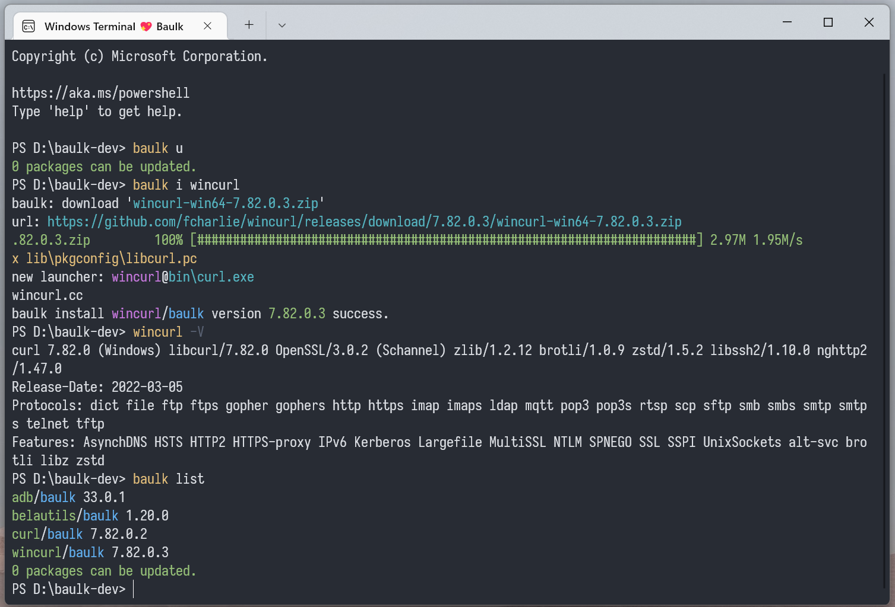
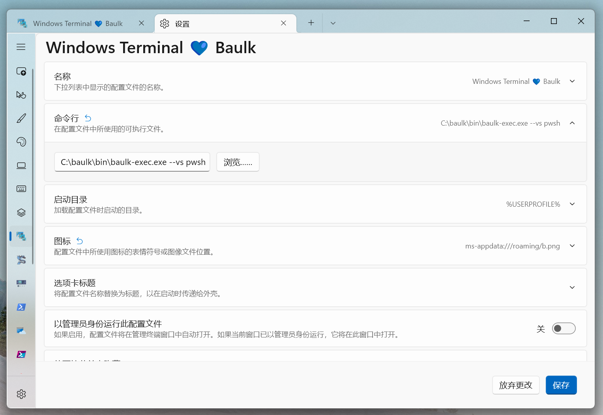

# Baulk - Windows 极简包管理器

[](LICENSE)
[](https://github.com/baulk/baulk/actions)
[](https://github.com/baulk/baulk/releases/latest)
[](https://github.com/baulk/baulk/releases)
[](https://github.com/baulk/baulk/releases/latest)
[](https://996.icu)


Baulk 是一个极简的、便携的 Windows 包管理器。

## 为什么有 Baulk

Baulk 最初是为了解决 [Clangbuilder](https://github.com/fstudio/clangbuilder) 的包管理器命令 `devi` 运行效率低下而诞生的，而 `devi` 基于 Powershell 编写，性能较差不言自明。

在 2020 年五月，微软宣布 Windows Package Manager Preview 时，Baulk 已经开发好几个月了，并不是说 winget 出现，类似的工具就不发展了，软件本来就要百家争鸣，百花齐放。另外，Baulk 在便携，隔离，虚拟环境，工具零依赖上比 winget/scoop 等包管理器做得更好，这些都是它存在的理由。

功能：
+  核心功能当然是包管理功能，特点是便携，免安装，所有的包无论是 msi/exe 还是压缩包，Baulk 都将其解压到包自身的根目录。
+  环境隔离与虚拟环境
    +  所有的包都有自己的目录，包中程序的调用通过其启动器或者符号链接发起，环境变量不干扰，不影响。
    +  同一软件存在不同的大版本，不同的发行版可以通过 venv 进行切换，如 openjdk/msjdk。
+  优秀的包提取体验：Baulk 自身提供了 zip/tar 等格式的解压能力，支持自动检测文件名编码，避免因 CodePagde 导致的文件名乱码。
    +  Baulk 还额外提供了 baulk extract/unzip/untar 这几个命令来供用户在其他场景使用 baulk 的解压功能。
    +  Baulk 还额外提供了 Unscrew Extractor (unscrew) 极简的图形化解压缩工具，能集成到右键菜单，提供一键解压 `tar.*` 文件的能力。
+  对 scoop manifest 的有限兼容 (兼容模式，无法使用 baulk 高级特性，如环境隔离和虚拟环境)。
+  纯 C++20 编写，性能优越。
+  下载包时智能感知网络设置。
+  支持使用 github-archives 或者 git 的方式更新 buckets。
+  Baulk 还提供了 `baulk brand` 检测操作系统信息的命令。

## 开始使用

我们可以去 Github Release 下载最新版本：[https://github.com/baulk/baulk/releases/latest](https://github.com/baulk/baulk/releases/latest)，如果有疑问可以参考下表。

|安装模式|x64|arm64|备注|
|---|---|---|---|
|完全便携|`Baulk-${VERSION}-win-x64.zip`|`Baulk-${VERSION}-win-arm64.zip`|解压到任意目录双击 baulk-terminal.exe 即可，（也可为其创建快捷方式）|
|无需管理员权限安装|`BaulkSetup-x64.exe`|` BaulkSetup-arm64.exe`|双击运行安装程序即可|
|需要管理员权限安装|`BaulkSetup-x64.exe`|`BaulkSetup-arm64.exe`|双击运行安装程序即可|
|实验性体验 Appx|`Baulk-x64.appx`|`Baulk-arm64.appx`|`baulk version > 4.0`|


安装好后你就可以体验 Baulk 了：

```powershell
# 安装你需要的任意软件包
# baulk i neovim curl wget ripgrep belautils
baulk install neovim curl wget ripgrep belautils
# 现在你可以在 Windows Terminal 中运行 curl 等命令了
curl -V
# 更新源数据
# baulk u --> baulk update && baulk upgrade
baulk update
# 升级可升级的包
baulk upgrade
# 卸载你不需要的包
# baulk r wget
baulk uninstall wget
```

看吧，简单至极！



搜索包：


集成到 Windows Terminal（shell 替换法）：




## 更新日志

[更新日志](./docs/changelog.md)

## 使用帮助

通常你可以运行 `baulk -h` 查看命令（其他命令也是 `-h`）的帮助信息，你也可以查看：[详细帮助](./docs/help.md)

## 进阶体验 Baulk


## 其他

Baulk 设计理念来自于 [clangbuilder](https://github.com/fstudio/clangbuilder) 的 [`devi`](https://github.com/fstudio/clangbuilder/blob/master/bin/devi.ps1) 工具，devi 是一个基于 PowerShell 开发的简易包管理工具，最初用于解决在搭建 LLVM/Clang 构建环境时依赖软件的升级问题，后来实现了 Ports 机制，也就成了一个小型的包管理工具。`devi` 支持安装，卸载升级包，并且还支持创建符号链接到特定的 `links` 的目录，这样的策略能够有效的减少 `PATH` 环境变量的条目，并且配合 `mklauncher` 能够支持不能使用符号链接的命令，创建它的启动器到 links。devi 的理念是避免安装软件需要特权，修改操作系统注册表。以及避免软件安装过程中修改操作系统环境变量。通常来说，将特定软件添加到环境变量中确实能够简化使用，但随着安装软件的增加，环境变量则会容易覆盖，多个版本的软件同时安装时可能会出现冲突，等等。从 2018 年 devi 的诞生到现在，我对软件的管理有了深刻的认识，对 devi 也有了反思，而 devi 存在诸多问题需要解决，比如包的下载不支持哈希校验，`mklauncher` 需要单独运行，启动较慢等等。思考良久后，我决定基于 C++17 和 [bela](https://github.com/fcharlie/bela) 实现新的包管理器，也就是 `Baulk`。Baulk 融汇了我这几年的技术积累，我自认为 baulk 要远胜于 devi，由于 PowerShell 启动较慢，执行较慢，devi 的执行速度完全比不上 baulk，实际上我在使用 Golang 重新实现基于 PowerShell 编写的 Golang 项目构建打包工具 [Bali](https://github.com/baulkbuild/bali) 时，有相同的感受。

Windows 在不断的改进，我也曾给 Windows Terminal 提交了 PR，我希望 Baulk 专注于在新的 Windows 上运行，因此在实现 Baulk 的时候，错误信息都使用了 ANSI 转义（Bela 实际上在旧的控制台支持 ANSI 转义转 Console API），Baulk 中也添加了 `baulk-terminal` 命令与 Windows Terminal 高度集成。此外还添加了脚本支持用户修改右键菜单，在资源管理器目录下按特定的启动路径打开初始化 Baulk 环境了的 Windows Terminal。


## 致谢

Baulk 依赖了许多许可证友好的开源项目，在这里我表示由衷的感谢。

+   [Bela - 提供了现代的 C++ 开发体验](https://github.com/fcharlie/bela.git)
+   [Ppmd - 解压缩以 `Ppmd` 压缩的 ZIP 文件](https://www.7-zip.org/sdk.html)
+   [Brotli - 解压缩 `tar.br` 文件和以 `brotli` 压缩的 ZIP 文件](https://github.com/google/brotli)
+   [bzip2 - 解压缩 `tar.bz` 文件和以 `bzip2` 压缩的 ZIP 文件](https://sourceware.org/bzip2/)
+   [Compact Encoding Detection - zip 非 UTF-8 文件名编码检测](https://github.com/google/compact_enc_det)
+   [zlib (Chromium 变体)  - 解压缩 `tar.xz` 文件和以 `defalte` 压缩的 ZIP 文件](https://github.com/chromium/chromium/tree/main/third_party/zlib)
+   [zlib (deflate64) - 解压缩以 `deflate64` 压缩的 ZIP 文件](https://github.com/madler/zlib/tree/master/contrib/infback9)
+   [liblzma - 解压缩 `tar.xz` 文件和以 `xz` 压缩的 ZIP 文件](https://tukaani.org/xz/)
+   [zstd - 解压缩 `tar.zst` 文件和以 `zstd` 压缩的 ZIP 文件](https://github.com/facebook/zstd)
+   [mimalloc - 紧凑且性能出色的通用内存分配器](https://github.com/microsoft/mimalloc)

<div>Baulk 图标来源于 <a href="https://www.flaticon.com/authors/smashicons" title="Smashicons">Smashicons</a> from <a href="https://www.flaticon.com/" title="Flaticon">www.flaticon.com</a></div>
